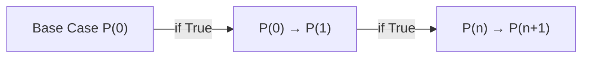

$$
\forall x \in \mathbb{N}: all \,P(n)\, is\, true

$$

> [!Note]
>  - 
Important propositions are called **theorems**.
>  - A **lemma** is a preliminary proposition useful for proving later propositions.
>  - A **corollary** is a proposition that follows in just a few logical steps from a lemma or a theorem

> [!tip]
> Because a conditionals contrapositive equals to itself proving contrapositive proves also the theorem.
# Sets

$S \subseteq T$ indicates that set S is a subset of set T and S may be equal to T.
$S \subset T$ indicates that set S is a subset of set.

$\overline A$ is consists from every element not in set A.Henceforth that is called **complement**
### Cardinality

|{1,2,3}| = 3
### Power set

Every subset of a set A.
### Cross product

A product of sets, S1 S2 , is a new set consisting of all sequences where the first component is drawn from S1, the second from S2, and so forth.

$\mathbb{N}\, \times \,\set{a,b} = \set{0,a}, \set{0,b}, \set{1,a}, \set{1, b} ...$

[[Lecture 3- Strong Induction]]